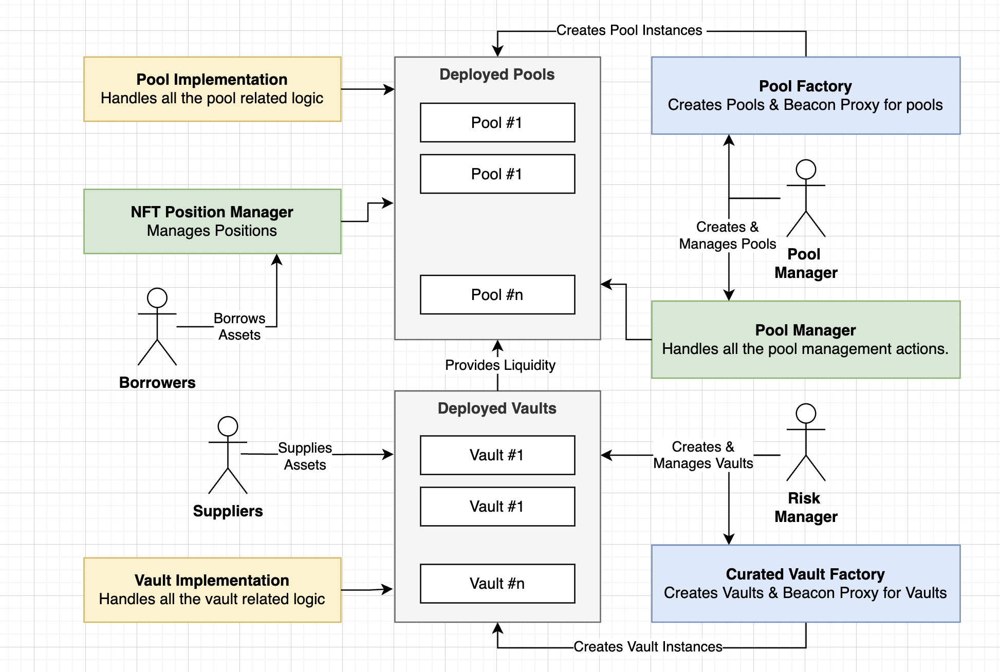

# ZeroLend One

[](https://github.com/zerolend/zerolend-one/actions/workflows/hardhat.yml)
[](https://github.com/zerolend/zerolend-one/actions/workflows/foundry.yml)
[](https://codecov.io/github/zerolend/zerolend-one)
[](https://www.npmjs.com/package/@zerolendxyz/one)

ZeroLend One is the next version of the ZeroLend protocol and introduces a highly scalable multi-chain lending protocol that is permission-less, isolated and curates risk management.

At the crux of ZeroLend One is Isolated markets. A scalable way for us to address lending demand across many chains and many assets without having to worry about scaling risk management

## Philosophy

While designing ZeroLend One, we keep the following philosophies in mind.

- **Highly customizable and Permissionless**: Anyone can create isolated lending pools on ZeroLend One with custom parameters and custom assets. Isolated markets are permission-less and inclusive. It enables anyone to lend/borrow assets or design their own isolated pool, regardless of their financial or geographical background.

- **Minimal Governance**: ZeroLend governance keeps politics to a bare minimum. Voters will play a major role in decisions such as emission voting without the need to have governance votes. Political decisions are kept at a bare minimum and the only governance votes made by $ZERO holders will be regarding protocol-related security.

- **Curated Risk Management**: Risk management at ZeroLend One is not delegated to a centralized entity but rather curated across many risk managers through vaults. Protocol risks are managed by vault managers and individual pool managers. Critical risk management actions undergo at least a one-day time lock. ZeroLend also further automates risk management by introducing the Automated Risk Manager (ARM).

- **Better UX**: With a focus on features such as NFT Positions, Smart Accounts and fixed rate lending, ZeroLend focuses bringing a better lending experience to users and give borrowers more control on their positions.

## Documentation



The following diagram gives a rough overview of the lending pool architecture. For a more in-depth documentation on how the protocol works view the various docs and links below.

- [docs-one.zerolend.xyz](https://docs-one.zerolend.xyz/) - Contains a high level overview of the entire protocol including architecture documentation.
- [wiki pages](https://github.com/zerolend/zerolend-one/wiki) - The wiki pages contains the technical documentation for each contract and what they do.
- [test folders](./test) - The unit tests for the protocol are also documented and can be browsed through for insights about how each test works.

## Tests

There are three test suites that this repository uses.

- [Hardhat](./test/hardhat) - Hardhat is used for all various kinds of feature tests. We test basic functionalities such as supply/borrow, creation of vaults etc.. and basic rules using hardhat tests.
- [Foundry](./test/forge) - Foundry is used to conduct various fuzzing and invariant tests.
- [Certora](./test/certora) - Certora is used to conduct all kinds of formal verification tests. This is more in-depth than the foundry tests but run a lot slower.

To compile and run the unit tests, simply run the following commands.

```
yarn
yarn compile
yarn test
```

Unit test coverages for hardhat and foundry; along with gas reports can be found here:

- [Hardhat coverage](https://zerolend.github.io/zerolend-one/hardhat/) - Code coverage of the hardhat unit tests
- [Foundry coverage](https://zerolend.github.io/zerolend-one/foundry/) - Code coverage of the foundry unit tests
- [Gas Report](https://zerolend.github.io/zerolend-one/gasReport.txt) - A gas report for each function

---

For any questions or queries, feel free to reach out to us on [Discord](https://discord.gg/zerolend)
